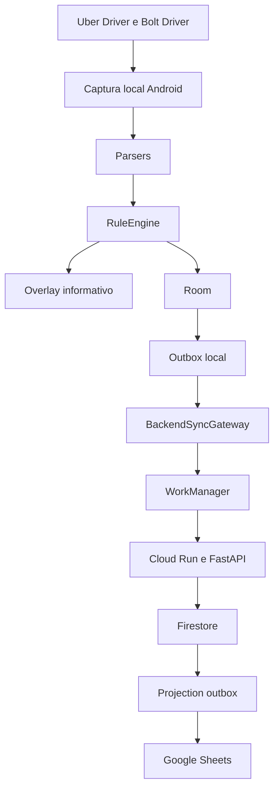
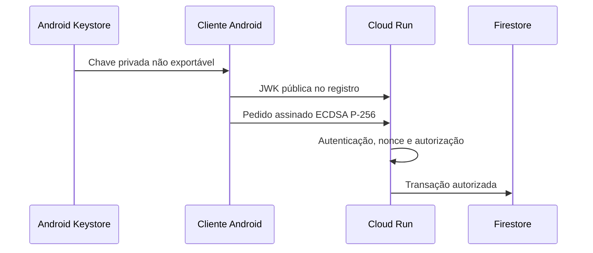
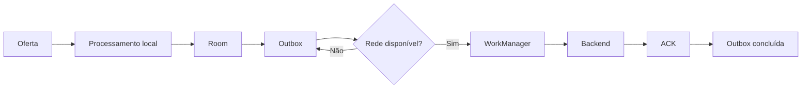

# Arquitetura do TVDE Insight

## Visão geral

Firestore é a fonte de verdade cloud. Google Sheets é relatório reconstruível e nunca participa da decisão local ou da atomicidade do sync.

## Android

### Captura e decisão

- Android 12L e inferiores: Uber e Bolt usam Accessibility.
- Android 13 e superiores: Bolt usa Accessibility e Uber usa captura global com OCR.
- O Notification Listener fornece gatilhos Bolt quando disponíveis.
- Os parsers transformam conteúdo transitório em uma oferta estruturada.
- O `RuleEngine` é independente da captura e da interface.
- O overlay apresenta o resultado e não controla Uber ou Bolt.

Esses componentes dependem de comportamento físico das aplicações externas. Não devem ser refatorados sem testes automatizados e validação em dispositivo.

### Persistência e sincronização

- Room, schema atual `5`, guarda análises e estado de sincronização.
- A outbox local mantém eventos até confirmação do backend.
- `SyncGateway` define a fronteira; `BackendSyncGateway` implementa API v1.
- `WorkManager` exige rede, usa trabalho único e backoff exponencial.
- O cursor permite delta sync. Agregados globais não incluem linhas brutas de outros motoristas.

### Identidade e segurança

A identidade de instalação usa Android Keystore. Reinstalação ou perda do dispositivo pode perder a chave privada. Isso exige novo vínculo autorizado; copiar arquivos não recupera uma chave não exportável.

## Backend

- FastAPI publica o contrato `/v1`.
- Cloud Run executa a API sem segredo Google dentro do APK.
- A autenticação usa ECDSA P-256 e assinatura canônica.
- Nonces impedem replay; idempotency keys tornam repetição segura.
- Firestore usa transações e IDs determinísticos para eventos, cursores, rate limiting e outbox.
- A projection outbox desacopla persistência da escrita no Google Sheets.
- O projetor pode repetir trabalho; a projeção precisa ser idempotente.

O backend local SQLite existe para desenvolvimento e provas de contrato. Ele não substitui Firestore no ambiente cloud.

## Fluxo offline

Erros de DNS, timeout e HTTP transitório não apagam a outbox. O trabalho é repetido com backoff. Falhas permanentes de autenticação ou incompatibilidade exigem diagnóstico, não repetição agressiva.

## Contratos e decisões

- [ADR-001](../backend/docs/ADR-001-secure-sync-api-v1.md): protocolo, segurança, privacidade e sync.
- [ADR-002](../backend/docs/ADR-002-local-persistent-backend.md): persistência local do backend e outbox.
- [ADR-003](../backend/docs/ADR-003-cloud-test-firestore.md): Firestore e projeção.
- [ADR-004](ADR-004-release-and-recovery-baseline.md): baseline, separação Client/Admin e rollback.

## Limites operacionais

- Captura depende da UI de terceiros e deve ser validada após mudanças relevantes das aplicações.
- DeX e tela dividida possuem políticas próprias; não inferir validação quando não testados.
- Backup do banco não recupera identidade do Android Keystore.
- Restore de Firestore e rollback de backend precisam ser ensaiados primeiro em ambiente isolado.
